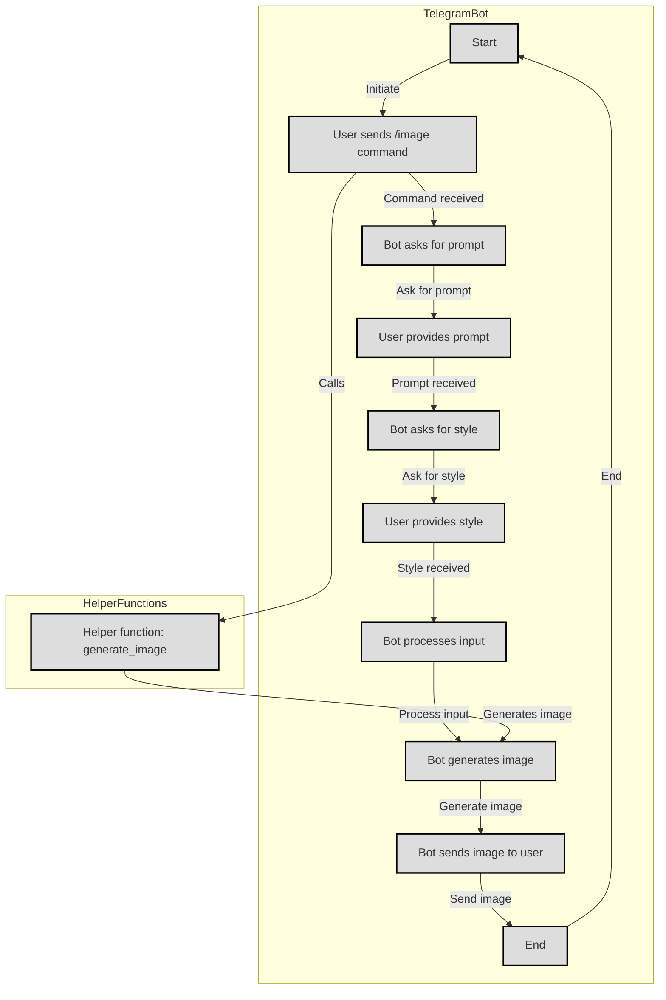

# Telegram Bot for Image Generation

This Telegram bot allows users to generate images based on provided prompts and styles using the Stability AI image generation API. The project is organized into two main files: `main.py` and `helper.py`.

## Table of Contents

- [Telegram Bot for Image Generation](#telegram-bot-for-image-generation)
  - [Table of Contents](#table-of-contents)
  - [1. Files and Structure](#1-files-and-structure)
    - [1.1 `main.py`](#11-mainpy)
    - [1.2 `helper.py`](#12-helperpy)
  - [2. Getting Started](#2-getting-started)
    - [2.1 Prerequisites](#21-prerequisites)
    - [2.2 Setting up Environment Variables](#22-setting-up-environment-variables)
    - [2.3 Running the Bot](#23-running-the-bot)
  - [3. Usage](#3-usage)
  - [4. Directory Structure](#4-directory-structure)
  - [5. Flowchart](#5-flowchart)
  - [6. Notes](#6-notes)

---

## 1. Files and Structure

### 1.1 `main.py`

This file serves as the main entry point for the Telegram bot. It contains the following key components:

- **Telegram Bot Setup**: Import required libraries, load environment variables, and configure logging.
- **State Constants**: Constants for different states of the conversation.
- **Conversation Handling**: Set up a ConversationHandler to manage user interactions.
- **Image Generation data**: Functions like `image` and `handle_text` to handle user commands and inputs.
- **Telegram Bot Initialization**: Set up the Telegram bot, add handlers, and start the bot.

### 1.2 `helper.py`

This file contains utility functions related to image generation. It includes:

- **Image Generation Function**: The `generate_image` function takes user prompts and styles as input and interacts with the Stability AI API to generate images.

## 2. Getting Started

Follow these steps to set up and run the Telegram bot:

### 2.1 Prerequisites

- Python 3.11 or higher installed on your system.
- Required libraries: `python-telegram-bot`, `requests`, `dotenv`. Install them using:

  ```bash
  pip install python-telegram-bot requests python-dotenv
  ```

### 2.2 Setting up Environment Variables

1. Create a `.env` file in the project directory.
2. Add the following entries to the `.env` file:

    ```dotenv
    STABILITY_API_KEY=your_stability_api_key
    TELEGRAM_BOT_TOKEN=your_telegram_bot_token
    ```

    Replace `your_stability_api_key` and `your_telegram_bot_token` with your Stability AI API key and Telegram bot token, respectively.

### 2.3 Running the Bot

Run the `main.py` script to start the Telegram bot:

```bash
python main.py
```

The bot is now active and ready to respond to commands.

## 3. Usage

1. Start a conversation with the Telegram bot.
2. Use the `/image` command to initiate the image generation process.
3. Follow the prompts to provide input for image generation, including prompts and style selections.
4. The bot will process the input, generate an image using the Stability AI API, and send the generated image back to the user.

## 4. Directory Structure

The project directory is organized as follows:

```plaintext
project-directory/
│
├── main.py
├── helper.py
├── .env
└── out/
    ├── (generated images)
```

- `main.py`: Main script for the Telegram bot.
- `helper.py`: Helper script containing utility functions.
- `.env`: Configuration file for storing environment variables.
- `out/`: Directory to store generated images.

## 5. Flowchart



## 6. Notes

- Ensure that the `./out` directory exists before running the bot. If not, it will be created during the image generation process.
- The bot requires a stable internet connection to interact with the Telegram API and Stability AI API.

---
