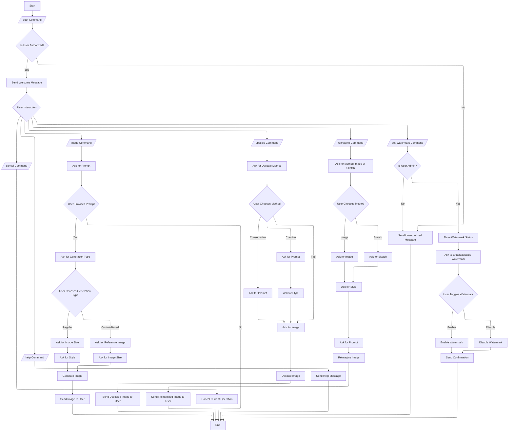

# AI Image Assistant Bot v2

The **AI Image Assistant Bot** is a Telegram bot designed to assist users in generating, upscaling, and reimagining images using AI-powered tools. The bot leverages the Stability AI API to provide high-quality image generation and manipulation capabilities. It is built using Python and the `python-telegram-bot` library, making it easy to deploy and use.

## Features

1. **Image Generation**:
   
   - Generate AI-powered images from text prompts.
   - Choose from various styles (e.g., photographic, digital-art, anime, etc.).
   - Select different image sizes and aspect ratios (e.g., square, portrait, landscape, etc.).
   - Control-based image generation using reference images.

2. **Image Upscaling**:
   
   - Upscale images to higher resolutions using different methods:
     - **Fast**: Quick upscaling with minimal enhancements.
     - **Conservative**: Balanced upscaling with moderate enhancements.
     - **Creative**: Advanced upscaling with creative enhancements based on a prompt.
   - Choose output formats (e.g., webp, jpeg, png).

3. **Image Reimagining**:
   
   - Transform existing images based on new concepts and prompts.
   - Choose between **Image** and **Sketch** methods for reimagining.
   - Apply different styles to the reimagined images.

4. **Watermark Control**:
   
   - Admins can enable or disable watermarking on generated images.
   - Watermark is applied to the bottom-left corner of the image.

5. **User Authentication**:
   
   - Only authorized users can access the bot's features.
   - Admins have additional privileges, such as toggling watermark settings.

## Flowchart



## Prerequisites

Before running the bot, ensure you have the following:

1. **Python 3.8 or higher** installed on your system.

2. **Telegram Bot Token**: Obtain a bot token by creating a new bot on Telegram using [BotFather](https://core.telegram.org/bots#botfather).

3. **Stability AI API Key**: Sign up for an API key from [Stability AI](https://stability.ai/).

## Installation

1. **Clone the repository**:
   
   ```bash
   git clone https://github.com/1999AZZAR/telegram-image-generation-bot.git
   cd telegram-image-generation-bot/v2
   ```

2. **Install dependencies**:
   
   ```bash
   pip install -r ../requirements.txt
   ```

3. **Set up environment variables**:
   
   - **Environment Variables**:
     
     - Create a `.env` file in the root directory and add the required environment variables with the following variables:
       
       ```plaintext
       STABILITY_API_KEY=your_stability_api_key
       TELEGRAM_BOT_TOKEN=your_telegram_bot_token
       USER_ID="*" # comma for separation, '*' to enable all user access.
       ADMIN_ID="*" # comma for separation, '*' to enable all user access.
       WATERMARK_ENABLED=true # true_or_false
       ```

4. **Run the bot**:
   
   ```bash
   python main.py
   ```

## Usage

Once the bot is running, you can interact with it on Telegram. Here are the available commands:

1. **/start**: Start the bot and get a welcome message with an overview of features.
2. **/help**: Get a list of available commands and tips for using the bot.
3. **/image**: Generate a new AI image from a text prompt.
   - Follow the prompts to provide a detailed description, select image size, and choose a style.
4. **/upscale**: Upscale an existing image.
   - Choose between **Fast**, **Conservative**, or **Creative** upscaling methods.
   - Provide a prompt if using the **Creative** method.
5. **/reimagine**: Reimagine an existing image based on a new concept.
   - Choose between **Image** or **Sketch** methods.
   - Provide a prompt and select a style for the reimagined image.
6. **/set_watermark**: Toggle watermarking on or off (Admin only).
7. **/cancel**: Cancel the current operation.

## Project Structure

- **main.py**: The main entry point for the bot. Initializes the bot and sets up conversation handlers.
- **helper.py**: Contains helper classes for authentication (`AuthHelper`) and image processing (`ImageHelper`).
- **models.py**: Defines data models and configurations for image generation, upscaling, and reimagining.
- **routes.py**: Handles Telegram bot commands and user interactions.

## Configuration

### Image Sizes and Styles

The bot supports various image sizes and styles, which are defined in the `ImageConfig` class in `models.py`. You can customize these presets by modifying the `SIZE_MAPPING`, `STYLE_PRESETS`, and `SIZE_PRESETS` dictionaries.

### Watermark

The watermark feature can be enabled or disabled by admins using the `/set_watermark` command. The watermark image (`logo.png`) should be placed in the root directory. If no watermark image is provided, the bot will skip watermarking.

## Error Handling

The bot includes comprehensive error handling for various scenarios, such as:

- Invalid user input.
- API request timeouts.
- Image download failures.
- Stability AI API errors.

If an error occurs, the bot will notify the user and provide instructions to retry the operation.

## Contributing

Contributions are welcome! If you'd like to contribute to this project, please follow these steps:

1. Fork the repository.
2. Create a new branch for your feature or bugfix.
3. Commit your changes and push to the branch.
4. Submit a pull request with a detailed description of your changes.

## Acknowledgments

- [Stability AI](https://stability.ai/) for providing the powerful image generation API.
- [python-telegram-bot](https://github.com/python-telegram-bot/python-telegram-bot) for the Telegram bot framework.
- [Pillow](https://pillow.readthedocs.io/) for image processing capabilities.

## Support

If you encounter any issues or have questions, please open an issue on the [GitHub repository](https://github.com/1999AZZAR/telegram-image-generation-bot/issues).

---

Enjoy using the **AI Image Assistant Bot**! 🎨🤖
